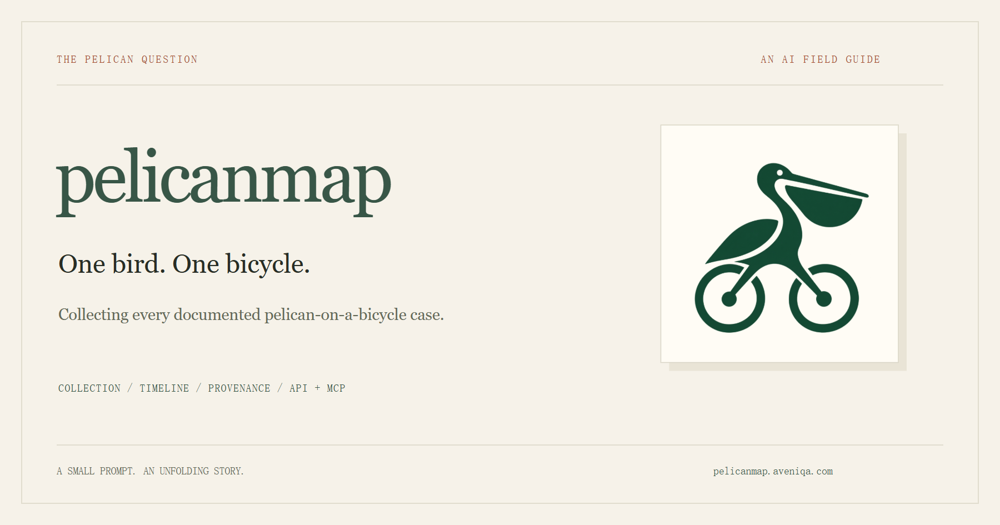
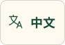
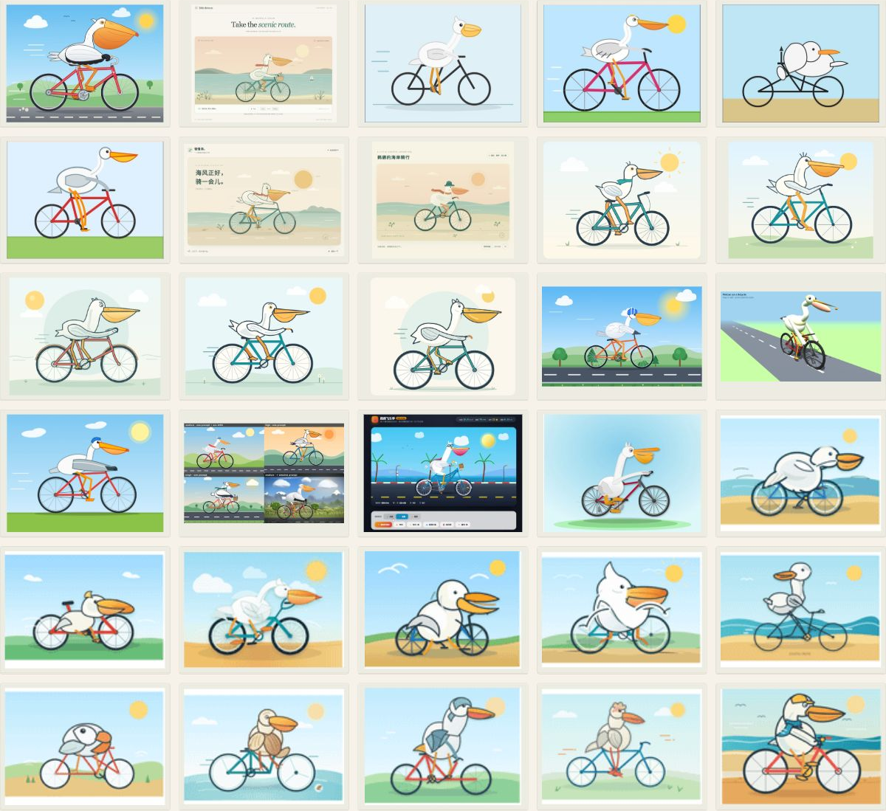
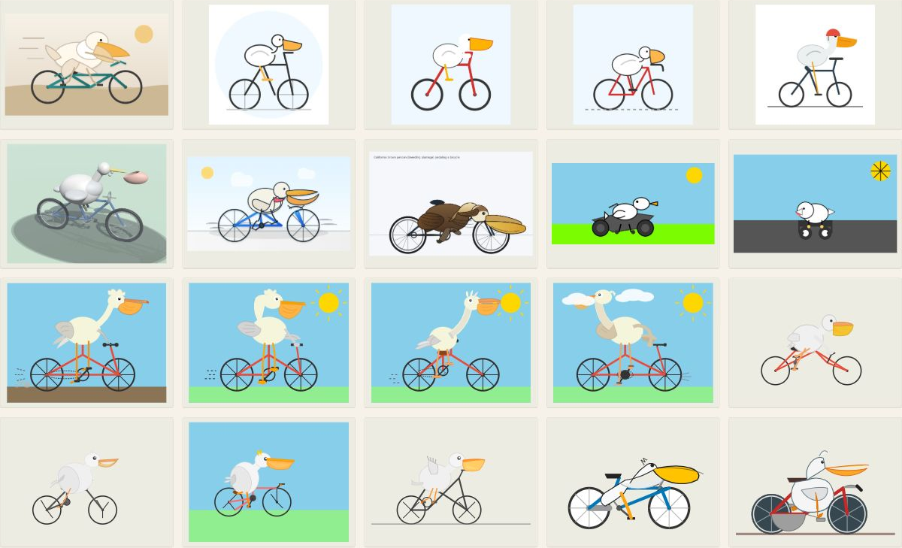
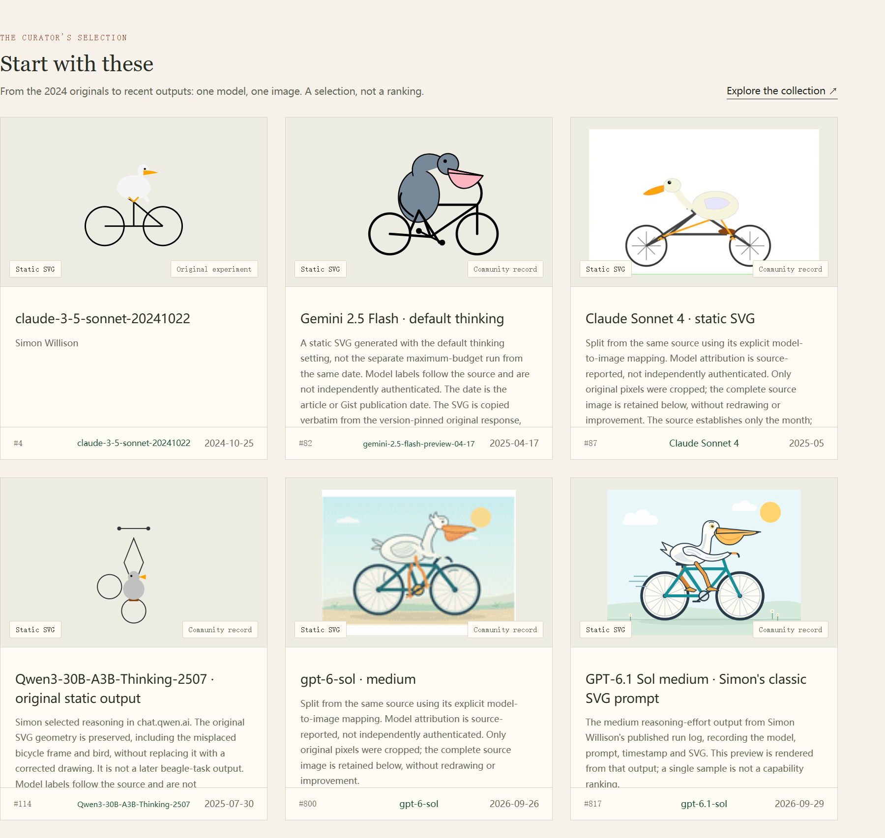

<p align="center"><a href="https://pelicanmap.aveniqa.com/en/specimens/?view=images"></a></p>

<p align="center">
  <a href="https://pelicanmap.aveniqa.com/en/"></a>
  <a href="https://pelicanmap.aveniqa.com/en/specimens/?view=images"></a>
  <a href="https://pelicanmap.aveniqa.com/en/sources/"></a>
  <a href="README.zh-CN.md" lang="zh-CN"></a>
</p>

<p align="center"><a href="https://github.com/UncleK/pelicanmap/actions/workflows/ci.yml"></a> </p>

**Collecting documented LLM code-generated pelicans across dates, from SVG to animation, 3D and interactive works.** Actual outputs, original sources, successes and failures — kept together.

<p align="center">
  <a href="https://pelicanmap.aveniqa.com/en/specimens/?view=images"></a>
  <a href="https://pelicanmap.aveniqa.com/en/timeline/"></a>
  <a href="https://unclek.github.io/pelicanmap/#statistics"></a>
</p>

[Live charts ↗](https://unclek.github.io/pelicanmap/#statistics) · Badges read the live API and may be cached. The timeline is a subset; benchmarks stay separate.

## One prompt. A whole flock.

<a href="https://pelicanmap.aveniqa.com/en/specimens/?view=images"></a>

```text
Generate an SVG of a pelican riding a bicycle.
```

[Images only](https://pelicanmap.aveniqa.com/en/specimens/?view=images) · [Timeline](https://pelicanmap.aveniqa.com/en/timeline/) · [Play](https://pelicanmap.aveniqa.com/en/play/) · [Sources](https://pelicanmap.aveniqa.com/en/sources/) · [Benchmarks](https://pelicanmap.aveniqa.com/en/tags/benchmark/)

## The earlier answers

<a href="https://pelicanmap.aveniqa.com/en/specimens/?year=2025&view=images"></a>

Original media and credits stay with each record. Model labels are source-reported, not independently authenticated. [Collection method](https://pelicanmap.aveniqa.com/en/about/).

Timeline and All works share exact-model version order, using documented releases or an explicitly provisional earliest source-work month, then artwork dates within each version. Artwork dates are never replaced, and no pending UI section is shown. Same-model works are expanded by default with optional folding. Moving previews play silently; genuine frames add no works. Direct text-to-video is outside the main collection; preserved legacy IDs/media remain uncounted context. New imports require generationMethod=code-generated and public codeGenerationEvidence.

## Explore the field guide

<a href="https://pelicanmap.aveniqa.com/en/"></a>

## API & MCP

```bash
curl 'https://pelicanmap.aveniqa.com/api/v1/specimens?q=Gemini&lang=en&limit=3'
```

```text
MCP  https://pelicanmap.aveniqa.com/mcp
     search_specimens · get_specimen · get_timeline
```

[JSON](https://pelicanmap.aveniqa.com/en/data/catalog.json) · [CSV](https://pelicanmap.aveniqa.com/en/data/catalog.csv) · [OpenAPI](https://pelicanmap.aveniqa.com/openapi.json) · [Agent guide](https://pelicanmap.aveniqa.com/en/llms.txt) · [Developer guide](https://pelicanmap.aveniqa.com/en/developers/) · [Integration examples](docs/INTEGRATIONS.md)

All works/search, `/api/v1/timeline` and `kind=timeline` share `model-release` ordering via `modelTimeline.sortDate`, then `artwork-date` within each version. Verified `releaseDate` is separately sourced. Missing release evidence uses the earliest counted source-work month as an explicit `inferred-position`, integrated without a pending UI section; `estimatedFrom` keeps its evidence, not a claimed launch day. Timeline years filter effective model positions; other search years still filter artwork dates. Legacy API `year=unknown` selects absent verified releases. `counts.timeline` is a subset of `counts.cases`; never add the two. Complete exports retain uncounted archives and Benchmark references: inspect `caseVisible`, `timelineVisible` and `referenceOnly`.

## Run locally

```bash
git clone https://github.com/UncleK/pelicanmap.git
cd pelicanmap
npm ci                 # Node.js 24
npm test
npm run start:api       # 127.0.0.1:48670
```

The checkout includes public catalog snapshots and the read-only API. Full archival builds also need the original media archive. [Development](docs/DEVELOPMENT.md) · [Contribute](CONTRIBUTING.md).

Collection updates preserve complete original motion: retain HTML/CSS/JS, required dependencies and original modules rather than extracting an SVG that loses its surrounding animation code. Reviewed moving works use dynamic covers in standard, compact and image-only views, with visible-only playback and static fallbacks. Restoring motion keeps the existing work ID, date, attribution and media; it does not add a work. Public intake does not require an open-source license. Source gaps remain documented; no replacement motion is invented. Reusable rules and byte-verified restorations live in [collecting-policy.json](site/collecting-policy.json) and [motion-restorations.json](site/motion-restorations.json).

Original code: **MIT**. Artworks and upstream materials keep their original rights and licenses. [Credits & licenses](NOTICE.md). Original prompt: [Simon Willison](https://simonwillison.net/2024/Oct/25/pelicans-on-a-bicycle/).
