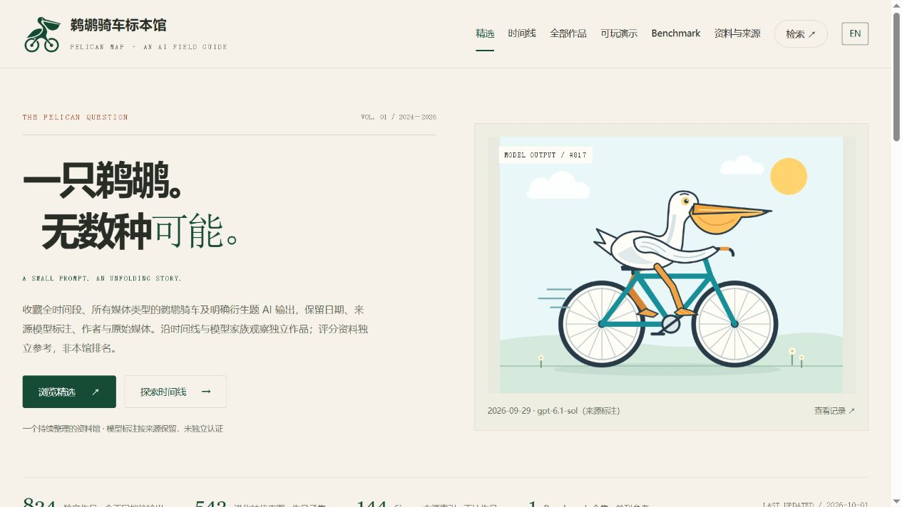

<p align="center"><a href="https://pelicanmap.aveniqa.com/"></a></p>

<p align="center"><a href="https://pelicanmap.aveniqa.com/">浏览标本馆 ↗</a> · <a href="https://pelicanmap.aveniqa.com/timeline/">探索时间线</a> · <a href="https://unclek.github.io/pelicanmap/">项目首页</a> · <a href="README.en.md">English</a></p>

<p align="center"><a href="https://github.com/UncleK/pelicanmap/actions/workflows/ci.yml"></a>  </p>

## 一个小问题，一部不断展开的 AI 小史

**“Generate an SVG of a pelican riding a bicycle.”**

一只鹈鹕怎样骑上一辆自行车？这个简单的题目，从 SVG 延伸到动画、视频、三维、游戏和有记录的 Agent 迭代。**pelicanmap** 把这些真实输出整理成一座可浏览、可追溯、可被程序读取的双语标本馆。

好作品值得停留，失败也值得收藏。这里保留作品原貌、来源模型标注、作者、日期依据和实际生成条件，让你沿着同一个问题，观察不同时间的回答。

| 824 件独立作品 | 543 张时间线代表图 | 144 篇来源索引 | 1 个 Benchmark 合集 |
| :---: | :---: | :---: | :---: |
| 不同真实档位分别记录 | 作品的代表子集 | Simon Willison 原文回链 | 独立参考，不计主馆 |

*统计快照：2026-10-01，已于 2026-10-02 对照公开目录。时间线与作品数不能相加；最新数量见[在线目录](https://pelicanmap.aveniqa.com/data/catalog.json)。*

<details><summary>看看标本馆的样子 ↗</summary>

[](https://pelicanmap.aveniqa.com/)

*正式网站截图；图中作品的署名与来源见[完整记录](https://pelicanmap.aveniqa.com/specimens/simon-gpt61-sol-medium-2026-09-29/)。*

</details>

## 带着问题逛一逛

| 入口 | 你会找到什么 |
| --- | --- |
| [精选](https://pelicanmap.aveniqa.com/) | 一件作品、一份记录；从早期原点到近期输出 |
| [时间线](https://pelicanmap.aveniqa.com/timeline/) | 按年份、模型家族和日期看代表作品 |
| [全部作品](https://pelicanmap.aveniqa.com/specimens/) | 搜索、筛选，切换标准 / 紧凑 / 纯图片视图 |
| [可玩演示](https://pelicanmap.aveniqa.com/play/) | 经审核、在独立域隔离运行的真实交互 |
| [Benchmark](https://pelicanmap.aveniqa.com/tags/benchmark/) | HF / OpenEnv 上游评分资料，非本馆排名 |
| [资料与来源](https://pelicanmap.aveniqa.com/sources/) | 原帖、作者仓库、提示词与引用链 |

## 把作品留下，把出处讲清楚

- **单模型、单时间点、单输出。** 转载、拼图或同一视频的多个帧不增加作品数；真实不同设置分别记录。
- **保留原始媒体。** 不重画、不美化失败输出。忠实裁切保留坐标、SHA-256 和完整原图。
- **保留证据的精度。** 只可证月份就写月份；公开日期不会冒充已认证生成日期。模型名按来源保留，未独立认证。
- **代表图有审核依据。** 明确运行组中优先作者默认档，否则 medium；没有合适依据就不猜。精选与时间线不是能力排行榜。
- **全部日期、全部媒体。** SVG、图像、动画、视频、3D、游戏及有过程记录的视觉 Agent 输出均可审核；记录工具、迭代和人工参与。

阅读[收录方法](https://pelicanmap.aveniqa.com/about/)与[来源及使用说明](https://pelicanmap.aveniqa.com/rights/)。

## 为人浏览，也为程序阅读

同一份审核目录生成中英文页面、JSON / CSV、Markdown、RSS、sitemap，以及只读 HTTP API 与 MCP。

```bash
curl 'https://pelicanmap.aveniqa.com/api/v1/specimens?q=Gemini&lang=en&limit=3'
curl 'https://pelicanmap.aveniqa.com/api/v1/timeline?family=Claude&sort=oldest&limit=10'
```

远程 MCP 地址：**`https://pelicanmap.aveniqa.com/mcp`**（Streamable HTTP）。工具为 `search_specimens`、`get_specimen`、`get_timeline`，支持 `lang: zh/en`，无需登录。

默认检索排除合集、来源存档和 Benchmark 参考行；稳定 ID 的直接查询保留。公开服务只读，不执行作品代码。

[JSON](https://pelicanmap.aveniqa.com/data/catalog.json) · [CSV](https://pelicanmap.aveniqa.com/data/catalog.csv) · [OpenAPI](https://pelicanmap.aveniqa.com/openapi.json) · [llms.txt](https://pelicanmap.aveniqa.com/llms.txt) · [RSS](https://pelicanmap.aveniqa.com/feed.xml) · [接入文档](https://pelicanmap.aveniqa.com/developers/)

## 本地开始

需要 **Node.js 24**。仓库带有双语公开目录快照，克隆后即可运行测试和本地只读 API：

```bash
git clone https://github.com/UncleK/pelicanmap.git
cd pelicanmap
npm ci
npm test
npm run start:api
```

打开 `http://127.0.0.1:48670/api/v1/specimens?limit=3`。预览项目首页：

```bash
python -m http.server 8000 --bind 127.0.0.1 --directory docs
```

打开 `http://127.0.0.1:8000/`。这是项目介绍页；完整馆藏运行在[正式网站](https://pelicanmap.aveniqa.com/)。完整网站生成器也在仓库中，但全量构建还需要未随 Git 分发的原始媒体、演示和历史核验资料，见[开发说明](docs/DEVELOPMENT.md)。

```text
docs/                 项目首页 · 沿用标本馆纸色 / 深绿 / 铁锈红
site/assets/          正式网站样式与浏览控件
site/catalog*.json    已发布的双语目录快照
site/*.json           作品单位、来源、代表图与演示审核规则
site/worker.mjs        只读 HTTP / MCP
tools/                页面生成、审核、导入和验证工具
pelican-web/data.js    历史基础目录的结构化记录
.github/              CI、Pages 发布与问题模板
```

## 参与这座标本馆

欢迎提交来源、修正署名和日期、反馈损坏链接，或改进浏览与数据工具。请先阅读 [CONTRIBUTING.md](CONTRIBUTING.md)；来源完整比候选数量重要。

**项目原创代码采用 MIT 许可；馆藏作品、上游代码与原文各自沿用原作者许可，不因收录而变成 MIT。** 第三方完整媒体、源码 ZIP、私钥、抓取日志和内部运维资料不随本仓库发布。详见 [NOTICE.md](NOTICE.md)。

原始题目与早期实验来自 [Simon Willison](https://simonwillison.net/2024/Oct/25/pelicans-on-a-bicycle/)。感谢每一位留下输出、提示词与生成过程的作者。

<p align="center"><sub>PELICAN MAP · AN AI FIELD GUIDE<br>一只鸟，一辆车，一段 AI 小史。</sub></p>
