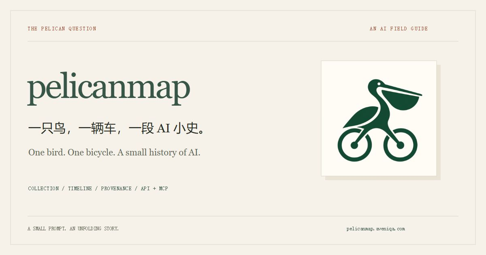

<p align="center"><a href="https://pelicanmap.aveniqa.com/specimens/?view=images"></a></p>

<p align="center"><a href="https://pelicanmap.aveniqa.com/specimens/?view=images">浏览馆藏 ↗</a> · <a href="https://unclek.github.io/pelicanmap/zh/">项目首页</a> · <a href="README.md">English</a></p>

**收集各模型、各时间段、所有媒体类型的鹈鹕骑车案例。** 保留真实输出、原始出处，也保留失败。

**824 件作品 · 543 张时间线代表图。** 2026-10-01 快照；时间线是作品子集，评分资料单列。

## 一个问题，一大群鹈鹕

<a href="https://pelicanmap.aveniqa.com/specimens/?view=images"></a>

```text
生成一张鹈鹕骑自行车的 SVG。
```

[纯图片](https://pelicanmap.aveniqa.com/specimens/?view=images) · [时间线](https://pelicanmap.aveniqa.com/timeline/) · [可玩演示](https://pelicanmap.aveniqa.com/play/) · [来源](https://pelicanmap.aveniqa.com/sources/) · [评分参考](https://pelicanmap.aveniqa.com/tags/benchmark/)

## 看看更早的回答

<a href="https://pelicanmap.aveniqa.com/specimens/?year=2025&view=images"></a>

原始媒体、作者与出处见各记录。模型按来源标注，未独立认证。[收录方法](https://pelicanmap.aveniqa.com/about/)。

## 数据与接口

```bash
curl 'https://pelicanmap.aveniqa.com/api/v1/specimens?q=Gemini&limit=3'
```

```text
MCP  https://pelicanmap.aveniqa.com/mcp
     search_specimens · get_specimen · get_timeline
```

[JSON](https://pelicanmap.aveniqa.com/data/catalog.json) · [CSV](https://pelicanmap.aveniqa.com/data/catalog.csv) · [接入文档](https://pelicanmap.aveniqa.com/developers/)

## 本地运行

```bash
git clone https://github.com/UncleK/pelicanmap.git
cd pelicanmap
npm ci
npm test
npm run start:api
```

需要 Node.js 24。仓库带公开目录快照和只读 API；完整构建另需原始归档。[开发说明](docs/DEVELOPMENT.md)。

原创代码 MIT；作品与上游资料沿用原作者许可。[来源与许可](NOTICE.md)。最初的题目来自 [Simon Willison](https://simonwillison.net/2024/Oct/25/pelicans-on-a-bicycle/)。
